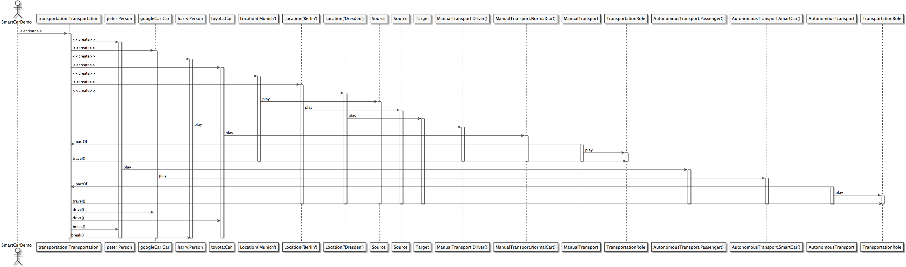

SCROLL Demo
===========

Models and code for the [SCROLL][roledispatch] demo application.

**1. Current state:** 

You are able to define compartments, roles and play-relationships. Invoking Role-methods is done via the [Dynamic][scala-dynamic] trait.
See the referenced [SCROLL][roledispatch] project for details.
  
**2. Edit and run:**

2.1. Clone this repository into your workspace.

2.2. Execute SBT and run ```gen-idea``` if you are using Intellij IDE <= 13 (to config see [here][sbt-gen-idea]). This is not required anymore since Intellij 14. Just use the built-in import SBT project functionality.

2.3. Or execute SBT and run ```eclipse``` if you are using the Eclipse Scala IDE. (to config see [here][gen-eclipse])

2.4. Run it from the SBT console with ```run``` and visit ```127.0.0.1:8080``` in your browser.

**3. Example - SmartCar:**

The [example][smartcar] is based on the following models:




```scala
class SmartCarDemo {
  val transportation = new Transportation {
    // adding some persons with their cars
    val peter = new Person("Peter")
    val googleCar = new Car("A-B-C-001")

    val harry = new Person("Harry")
    val toyota = new Car("A-B-C-002")

    // adding some locations
    new Location("Munich") play new Source()
    new Location("Berlin") play new Source()
    new Location("Dresden") play new Target()

    // and doing a manual transportation now
    harry play new ManualTransport.Driver()
    toyota play new ManualTransport.NormalCar()
    ManualTransport partOf this
    
    +toyota drive()
    ManualTransport play new TransportationRole(one[Source]("name" ==# "Berlin"), one[Target]()) travel()

    // and here a autonomous one
    peter play new AutonomousTransport.Passenger()
    googleCar play new AutonomousTransport.SmartCar()
    AutonomousTransport partOf this
    
    +googleCar drive()
    AutonomousTransport play new TransportationRole(one[Source]("name" ==# "Munich"), one[Target]()) travel()

    +peter brake()
    +harry brake()
  }

  /**
   * Defining all natural types.
   */

  class Person(val name: String)

  class Car(val licenseID: String)

  class Location(val name: String)

  /**
   * Defining all contexts with it's roles.
   */

  class Charging() extends Compartment {

    class ChargingStation() {
      def doCharge() {
        info("Charging ...")
      }
    }

    class ChargingCar() {
      def drive() {
        info("I can't drive while charging!")
      }
    }
  }

  class Transportation() extends Compartment {

    object AutonomousTransport extends Compartment {

      class SmartCar() {
        def drive() {
          info("I am driving autonomously!")
        }
      }

      class Passenger() {
        def brake() {
          val name: String = (+this).name
          info(s"I can't reach the brake. I am $name and just a passenger!")
        }
      }
    }

    object ManualTransport extends Compartment {
      class NormalCar() {
        def drive() {
          val driver = one[Driver]()
          info("I am driving with a driver called " + (+driver).name + ".")
        }
      }

      class Driver() {
        def brake() {
          val name: String = (+this).name
          info(s"I am $name and I am hitting the brakes now!")
        }
      }
    }

    class TransportationRole(source: Source, target: Target) {
      def travel() {
        val from: String = (+source).name
        val to: String = (+target).name
        val license: String = one[Car]().licenseID

        val kindOfTransport = getCoreFor(this) match {
          case ManualTransport => "manual"
          case AutonomousTransport => "autonomous"
        }
        info(s"Doing a $kindOfTransport transportation with the car $license from $from to $to.")
      }
    }

    class Target()

    class Source()
  }
}
```

Running it produces the following output:

```
I am driving with a driver called Harry.
Doing a manual transportation with the car A-B-C-002 from Berlin to Dresden.
I am driving autonomously!
Doing a autonomous transportation with the car A-B-C-001 from Munich to Dresden.
I can't reach the brake. I am Peter and just a passenger!
I am Harry and I am hitting the brakes now!
```


[sbt-gen-idea]: https://github.com/mpeltonen/sbt-idea
[gen-eclipse]: https://github.com/typesafehub/sbteclipse
[scala-dynamic]: http://www.scala-lang.org/api/current/#scala.Dynamic
[roledispatch]: https://github.com/max-leuthaeuser/SCROLL
[smartcar]: https://github.com/max-leuthaeuser/VLDBDemo/blob/master/src/main/scala/model/SmartCarDemo.scala
