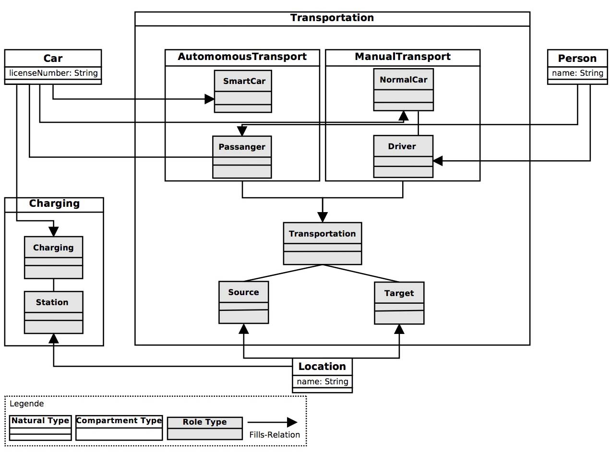

VLDBDemo
========

Models and code for the VLDB demo application.

**1. Current state:** 

You are able to define compartments, roles and play-relationships. Invoking Role-methods is done via the [Dynamic][scala-dynamic] trait.
See the referenced [RoleDispatch][roledispatch] project for details.
  
**2. Edit and run:**

2.1. Clone [RoleDispatch][roledispatch] into your workspace.

2.2. Clone this repository into your workspace.

2.3. Execute SBT and run ```gen-idea``` if you are using Intellij IDE <= 13 (to config see [here][sbt-gen-idea]). This is not required anymore since Intellij 14. Just use the built-in import SBT project functionality.

2.4. Or execute SBT and run ```eclipse``` if you are using the Eclipse Scala IDE. (to config see [here][gen-eclipse])

**3. Example - SmartCar:**

The example ```SmartCar``` is based on the following model:



[sbt-gen-idea]: https://github.com/mpeltonen/sbt-idea
[gen-eclipse]: https://github.com/typesafehub/sbteclipse
[scala-dynamic]: http://www.scala-lang.org/api/current/#scala.Dynamic
[roledispatch]: https://github.com/max-leuthaeuser/RoleDispatch
